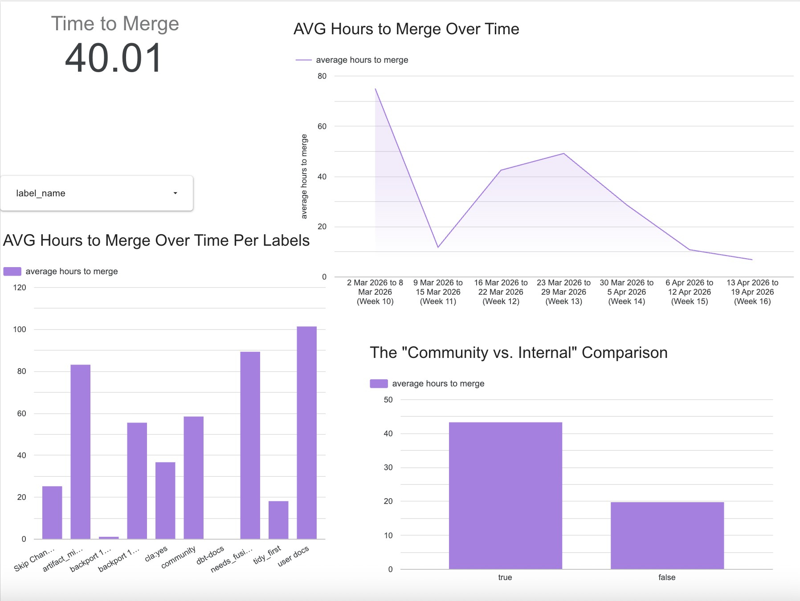
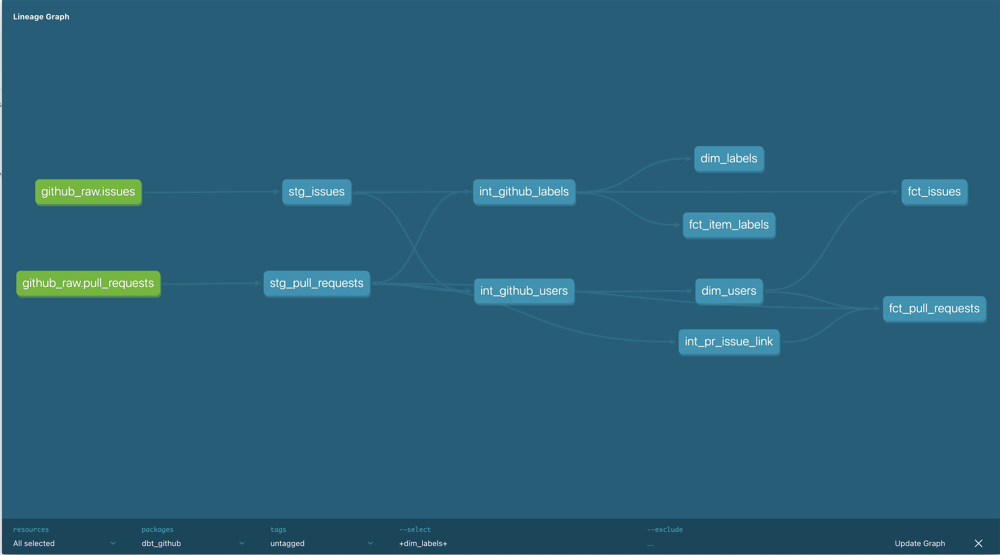

# GitHub Development Velocity Analytics

  

## 📌 Project Overview
This project is an end-to-end Analytics Engineering pipeline designed to monitor and visualize repository health. It transforms raw, nested JSON data from the GitHub API into a clean, warehouse-ready Star Schema.

### Key Objective 
To measure developer velocity (Time to Merge) and issue responsiveness, while handling the complex many-to-many relationships of GitHub labels.

## 🛠 The Tech Stack
- Ingestion: Python (Custom API Loader)
- Data Warehouse: Google BigQuery
- Transformation: dbt (data build tool)
- Visualization: Looker Studio

## 🏗 Data Modeling & Architecture
The core of this project follows a Medallion Architecture:
1. Bronze (Raw): Landing zone for JSON payloads from GitHub issues and pulls endpoints.
2. Silver (Intermediate): Heavy cleaning including:
    - Regex parsing of PR descriptions to link Issues to Pull Requests.
    - Standardizing timestamps for duration calculations.
    - Flagging entities (e.g., is_bug, is_community_contribution).
3. Gold (Marts): Optimized for reporting: 
    - Facts: fct_pull_requests, fct_issues.
    - Dimensions: dim_users, dim_labels.
    - Bridge: fct_item_labels (Handles many-to-many labels).
    

  

## 💡 Key Engineering Challenges & Solutions
1. Handling Many-to-Many Relationships (Label Fan-out)
- Challenge: A single PR can have multiple labels. Joining labels directly to fact tables causes "fan-out," which artificially inflates count and duration metrics in BI tools.
- Solution: I implemented a Bridge Table (fct_item_labels). In the BI layer, I utilized Data Blending and DISTINCT logic in SQL to ensure that even if a PR has 5 labels, its "Average Hours to Merge" is only calculated once per label entity.

2. Logic for is_bug Identification
- Challenge: GitHub doesn't have a "Bug" checkbox; it relies on labels. Labels can be null or change over time.
- Solution: I built a robust classification logic in dbt using COALESCE and subqueries to scan the label bridge table. If an item contains a label matching %bug%, it is flagged at the Silver layer. This allows for simple boolean filtering in the dashboard without complex joins.

## 📊 Key Metrics TrackedMetric
- Hours to Merge: timestamp_diff(merged_at, created_at, HOUR).

- Is Bug Flag: A boolean derived by scanning labels for the 'bug' string, denormalized into fct_issues for performance.

- Community Contribution: Identifying external vs. internal work using author_association.

🚀 Future RoadmapOrchestration: 
- Implement Dagster or Airflow to automate the Python ingestion and dbt runs.
- Scale: Expand the API loader to fetch data from multiple high-volume repositories (e.g., dbt-core or Kubernetes).

### How to Run
1. Loader: python main.py (Requires GITHUB_TOKEN and GCP_CREDENTIALS).
2. dbt: dbt build (Runs models, seeds, and tests).